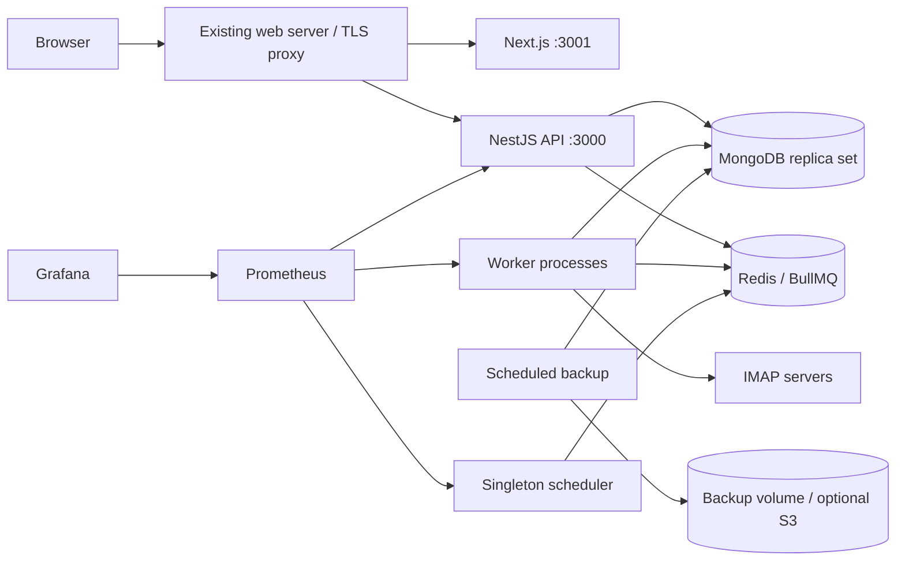
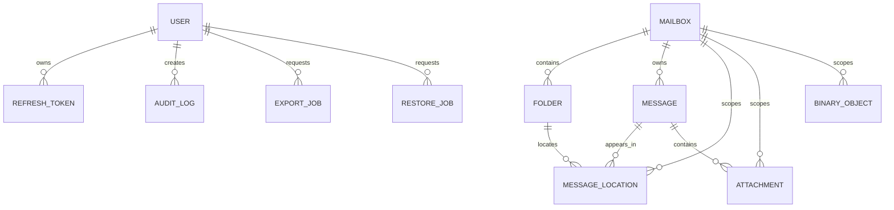

# Email Backup Platform

A self-hosted, multi-mailbox IMAP backup platform built as a pnpm monorepo. It is designed to run continuously, keep mailbox data logically isolated, preserve source-deleted email, and evolve through independently deployable API, worker, scheduler, and web processes.

> Development is performed on the `dev` branch. This revision intentionally does **not** include Nginx because the deployment target already has a web server. The frontend and API publish loopback-only ports for that existing reverse proxy.

## Current implementation status

This branch contains the production foundation and the first working vertical slice:

- NestJS/Fastify API with strict validation, Pino redaction, JWT access tokens, rotating refresh-token records, Argon2id passwords, role guards, and initial super-admin bootstrap.
- AES-256-GCM mailbox credential encryption with versioned keys and mailbox-bound authenticated data.
- Mailbox creation, editing, connection testing, pause/resume, reconciliation queueing, statistics, and configuration-only deletion.
- BullMQ queue registry, worker heartbeat, mailbox connectivity processing, IMAP folder discovery, Sent-folder detection, reconciliation, cleanup, and scheduler leadership.
- MongoDB replica-set deployment with authentication and an idempotent application-user initializer.
- Shared MongoDB collections and indexes for users, refresh tokens, mailboxes, folders, messages, locations, attachments, binaries, exports, restores, sync events/errors, integrity reports, audit logs, and system settings.
- Next.js/Tailwind administration UI for sign-in, mailbox overview, and Hostinger-compatible mailbox creation.
- Prometheus endpoints, provisioned Grafana data source/dashboard, scheduled `mongodump` including GridFS collections, checksums, optional encryption, retention, and optional S3-compatible upload.
- Development-only Swagger/OpenAPI registration and mandatory production rejection when either route is enabled.

Full MIME synchronization, export generation, IMAP APPEND restore, integrity repair, expanded UI, and integration test coverage remain subsequent phases. The database, queue, security, and process boundaries are already structured for those additions.

## Architecture decisions

| Area | Decision |
|---|---|
| Runtime | Node.js 22, strict TypeScript |
| API | NestJS with Fastify; no long-running synchronization in request handlers |
| Web | Next.js, React, Tailwind CSS, TanStack Query, React Hook Form, Zod |
| Mail | ImapFlow and Mailparser; Hostinger defaults are presets, not hard-coded constraints |
| Database | Shared MongoDB collections with mandatory `mailboxId`; GridFS bucket `emailBinaries` |
| Queue | Redis and BullMQ; MongoDB remains the source of truth |
| Security | Argon2id, JWT rotation, HTTP-only refresh cookie, CSRF double-submit validation, AES-256-GCM credentials, Docker secrets |
| Monitoring | Prometheus metrics and provisioned Grafana dashboard |
| Deployment | Docker Compose without a bundled reverse proxy; published services bind to `127.0.0.1` by default |



## MongoDB relationships



Identical messages received by separate accounts remain separate because every message, location, attachment, binary reference, event, export, and restore is scoped by `mailboxId`. No collection is created per mailbox.

## Directory structure

```text
apps/api          NestJS Fastify REST API
apps/worker       BullMQ consumers and IMAP operations
apps/scheduler    singleton recurring-job registrar
apps/web          Next.js administration dashboard
packages/config   Zod environment and Docker-secret validation
packages/database Mongoose schemas and indexes
packages/domain   roles, states, queue names, stable error codes
packages/encryption AES-256-GCM credential service
packages/imap     ImapFlow connection/folder helpers
packages/logging  Pino redaction configuration
packages/metrics  Prometheus registry
packages/queue    Redis and BullMQ registry
packages/schemas  shared Zod schemas
packages/shared   hashes, filename and CSV safety helpers
docker            MongoDB, backup, Prometheus, and Grafana assets
```

## Existing web-server contract

The Compose stack publishes only loopback interfaces by default:

- Frontend: `127.0.0.1:3001`
- API: `127.0.0.1:3000`
- Grafana: `127.0.0.1:3002`
- Prometheus: `127.0.0.1:9090`

Configure the existing web server to send `/api/*` to port `3000` without stripping `/api`, and all dashboard traffic to port `3001`. Large export responses should have buffering disabled and generous timeouts. MongoDB and Redis have no host ports.

## Secret creation

```bash
./scripts/generate-secrets.sh
cp .env.example .env
```

Review `.env`, especially `PUBLIC_BASE_URL`, `CORS_ORIGINS`, bind addresses, and production Swagger flags. Secret files are excluded from Git.

## Hostinger mailbox defaults

When adding a Hostinger mailbox:

```text
IMAP host: imap.hostinger.com
Port: 993
TLS: enabled (implicit SSL/TLS)
Username: full mailbox email address
Password: mailbox password
TLS certificate verification: enabled
```

Cloudflare DNS hosting does not interfere with a direct TLS connection to the configured IMAP hostname. The platform can store any standards-compliant IMAP provider configuration.

## Local development

```bash
./scripts/generate-secrets.sh
cp .env.example .env
NODE_ENV=development SWAGGER_ENABLED=true OPENAPI_JSON_ENABLED=true docker compose -f compose.yaml -f compose.override.yaml up --build
```

Development documentation:

- Swagger UI: `http://127.0.0.1:3000/api/docs`
- OpenAPI JSON: `http://127.0.0.1:3000/api/openapi.json`

## Production deployment

```bash
./scripts/generate-secrets.sh
cp .env.example .env
# Edit .env and keep both documentation flags false
docker compose build
docker compose up -d
./scripts/verify-production.sh
```

Production startup fails during environment validation when `SWAGGER_ENABLED=true` or `OPENAPI_JSON_ENABLED=true`. When disabled, documentation routes are never registered and return `404` without relying on an external proxy rule.

## Health and readiness

- API process health: `GET /health`
- API dependency readiness: `GET /ready`
- API metrics: `GET /metrics`
- Frontend health: `GET /health` on port `3001`
- Worker health/metrics: internal port `3002`
- Scheduler leader health/metrics: internal port `3003`

## Backup and disaster recovery

The `backup` container performs an immediate backup at startup and then follows `BACKUP_SCHEDULE`. `mongodump` includes regular collections and GridFS collections in the selected database. Each archive receives a SHA-256 checksum. Optional archive encryption uses PBKDF2-derived AES-256-CBC; the key remains a Docker secret and is not stored in the backup volume.

Restore from inside the backup container:

```bash
docker compose exec backup /scripts/restore.sh /backups/email_backup-YYYYMMDDTHHMMSSZ.archive.gz
```

For encrypted archives, pass the `.enc` file. The restore script decrypts to a temporary file and executes `mongorestore --drop`. Test restores on a separate environment before disaster recovery.

A server migration requires the repository, `.env`, Docker secret files, and copied named-volume data or a verified backup archive. Credential ciphertext is unusable without the same credential encryption key and key version.

## Security checklist

- Keep host-published ports bound to loopback unless a firewall and authenticated proxy require otherwise.
- Keep MongoDB, Redis, Prometheus, and Grafana off public interfaces.
- Back up Docker secrets separately from database archives.
- Rotate JWT and mailbox encryption keys using controlled key-version migration.
- Keep TLS certificate verification enabled for IMAP.
- Set a strong initial administrator password and replace it after first login.
- Restrict Grafana through the existing web server or SSH tunneling.
- Review audit records before privileged deletion, export, or restore operations.

## Commands

```bash
pnpm install
pnpm typecheck
pnpm test
pnpm build
docker compose config --quiet
docker compose up -d --build
```

## Troubleshooting

- **MongoDB never becomes ready:** verify the replica key is non-empty, has no newline-related corruption, and secret files are readable by Docker.
- **Application authentication fails:** the application user is created in the `admin` authentication database with `readWrite` on the configured application database.
- **Redis readiness fails:** confirm the same `redis_password` secret is mounted to API, workers, scheduler, and Redis.
- **IMAP TLS failure:** verify hostname, port, system time, certificate chain, and optional TLS server name. Do not solve production TLS failures by disabling certificate validation.
- **Mailbox connects but Sent is missing:** the worker first checks `\\Sent`, then common names and administrator override. SMTP clients must save or append server-side Sent copies for them to be backed up.
- **Swagger appears in production:** startup should fail. Recheck the effective Compose environment with `docker compose config`.
